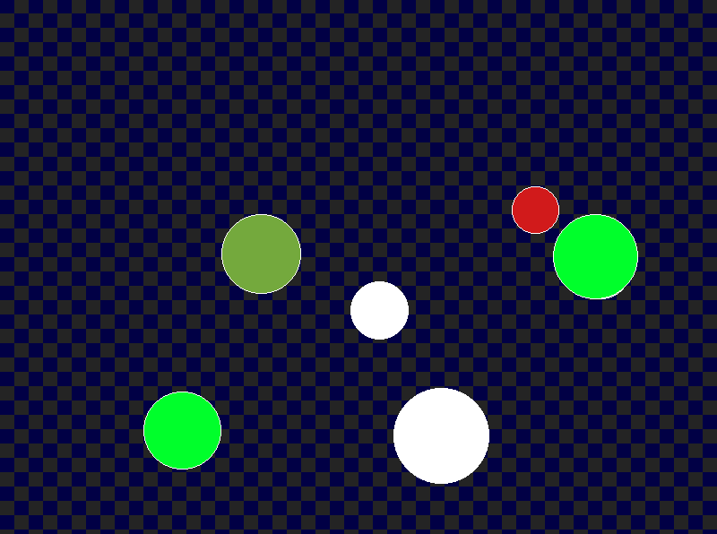

# WebAssembly Example: Bouncing Balls with Emscripten

## Setup

### Install emsdk

First download and install the emsdk for Emscripten following the instructions from <https://emscripten.org/docs/getting_started/downloads.html#sdk-download-and-install>.

There are some platform specific prerequisites, which I won't cover in detail here.
See <https://emscripten.org/docs/getting_started/downloads.html#platform-notes-installation-instructions-sdk> for the latest version.

For macOS you will need Xcode and Xcode command line tools installed.
You will also need CMake.

For Windows and Linux you need python installed. For mac it comes bundled with the emsdk.

For all platforms you will need to be able to run a webserver for static files to test. 
You can do this with Python, as described below.

### Verify installation

```sh
emcc -v
```

## Hello, World

First let's do something very simple to make sure things are working.

Add this source to a file named hello.c

```c
#include <stdio.h>

int main()
{
  printf("Hello, World!\n");
  return 0;
}
```

Build it with this command:

```sh
emcc hello.c
```

(optional): Run it using node (requires NodeJS to be installed):

```sh
node a.out.js
```

Test it in a browser by generating HTML.

```sh
emcc hello.c -o hello.html
```

For most modern browsers the cross-site request forgery protections will prevent you loading some of the needed files if you just open the HTML directory.
To get around this for testing you need a local webserver.
You can run one with Python like this (requires Python 3 to be installed).

```sh
python -m http.server 8008 --bind 127.0.0.1
```

This will use port 8008(it uses 8080 by default).

And the bind parameter makes it listen only on localhost so that the server will only be accessible from your machine via loopback instead of over other network interfaces.

You can then visit the URL <http://127.0.0.1:8008/hello.html> to see the page which should print your "Hello, World!" output.

## Bouncing Balls

Let's do something more interesting.

This example draws different colored bouncing balls on a checkered background using SDL.

The C code is in bouncing.c, draw.c, and draw.h.

Below is the build command needed for information.
You can just run `./build.sh` on Linux or MacOS.

- Using a minimal HTML shell template instead of the default.
- And adding our own Javascript in main.jc

```sh
 emcc checkers_sdl.c -o dist/checkers.html --shell-file wasm_shell.html -sEXPORTED_RUNTIME_METHODS=ccall,cwrap -sEXPORTED_FUNCTIONS=_main,_NumString --extern-post-js main.js --emrun
```

## Screenshot

